# Manual de Usuario
**UNIVERSIDAD DE SAN CARLOS DE GUATEMALA**  
**FACULTAD DE INGENIERÍA**     
**CATEDRÁTICO:** Ing. Edgar René Ornelis Hoíl
**TUTOR  ACADÉMICO:** Elian Saúl Estrada Urbina  
**Nombre:** Brandon Antonio Marroquín Pérez  
**Carnet:** 202300813  
**Fecha de Entrega:** 17 de diciembre de 2024  
**Curso:** LABORATORIO ESTRUCTURAS DE DATOS Sección A
**Semestre:** Quinto Semestre 2024 

---

# Introducción

El proyecto **Renta de Activos** es una aplicación desarrollada en C++ que permite gestionar el alquiler de activos entre usuarios. Está diseñado para funcionar como un sistema de consola, implementando estructuras de datos avanzadas como matrices dispersas, árboles AVL y listas circulares doblemente enlazadas. Estas estructuras permiten manejar de manera eficiente la información relacionada con usuarios, activos y transacciones.

El sistema permite a los usuarios registrarse, añadir activos para alquiler, gestionar sus alquileres y realizar devoluciones. Además, un usuario administrador tiene capacidades especiales, como la generación de reportes gráficos con Graphviz y la gestión de usuarios y transacciones. Este proyecto es una demostración práctica de los conceptos aprendidos en el curso de Estructuras de Datos, aplicando memoria dinámica y apuntadores para maximizar el rendimiento y la funcionalidad del sistema.

---

# Objetivos

## Objetivo General

- Desarrollar un sistema eficiente para la gestión de alquileres de activos, aplicando estructuras de datos avanzadas y técnicas de programación dinámica en C++.

## Objetivos Específicos

1. Implementar estructuras de datos como matrices dispersas, árboles AVL y listas circulares doblemente enlazadas para gestionar usuarios, activos y transacciones.
2. Diseñar funcionalidades de administración que permitan la generación de reportes gráficos y la gestión de usuarios y transacciones de manera intuitiva y eficiente.

---
# Información del Sistema

El sistema fue desarrollado utilizando el lenguaje de programación C++ en un entorno de desarrollo CLion, apoyado por WSL (Windows Subsystem for Linux). Se utilizaron técnicas de programación orientada a objetos y manejo de memoria dinámica para garantizar la eficiencia y escalabilidad del sistema.

La herramienta Graphviz fue integrada para la generación de reportes gráficos, facilitando la representación visual de las estructuras de datos, como la matriz dispersa y el árbol AVL. Todo el desarrollo fue diseñado para ejecutarse desde la consola, asegurando una interacción fluida y centrada en el usuario.

---

# Requisitos del Sistema

1. **Sistema Operativo**: Windows 10 o superior con soporte para WSL (Windows Subsystem for Linux).
2. **Entorno de Desarrollo**: CLion o cualquier IDE compatible con proyectos en C++.
3. **Dependencias**:
    - WSL configurado con una distribución Linux (como Ubuntu).
    - Graphviz instalado para la generación de gráficos.
4. **Hardware Recomendado**:
    - Procesador: Intel i5 o equivalente.
    - Memoria RAM: 8 GB o superior.
    - Espacio en disco: Al menos 500 MB para archivos del sistema y dependencias.
5. **Compilador**: GCC compatible con C++11 o superior.
6. **Permisos**: Acceso a la consola del sistema operativo para ejecutar comandos y generar reportes gráficos.

---

# FLUJO DE LAS FUNCIONALIDADES DEL SISTEMA
- Primero iniciamos el programa
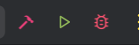
- Se elige una opcion
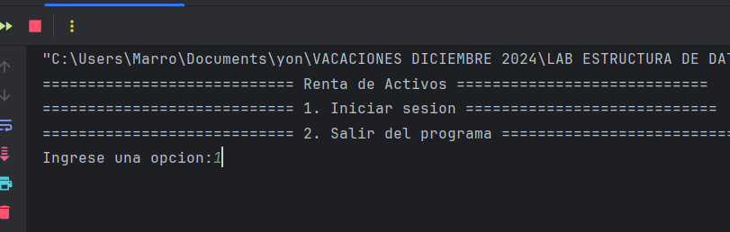
- se inicia como admin en todo lo que pide para entrar al menu administrador
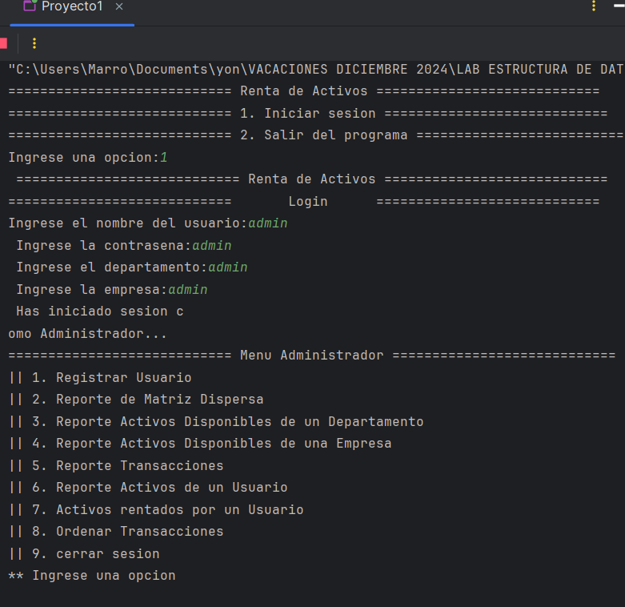
- se elige la opcion de registrar Usuario y agregas un usuario
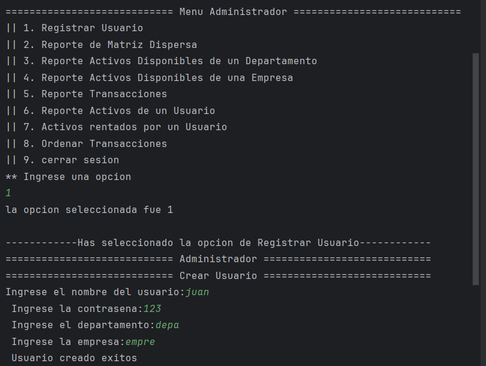
-luego le podes dar al reporte de la matriz para ver como esta el usuario con sus empresas y departamentos
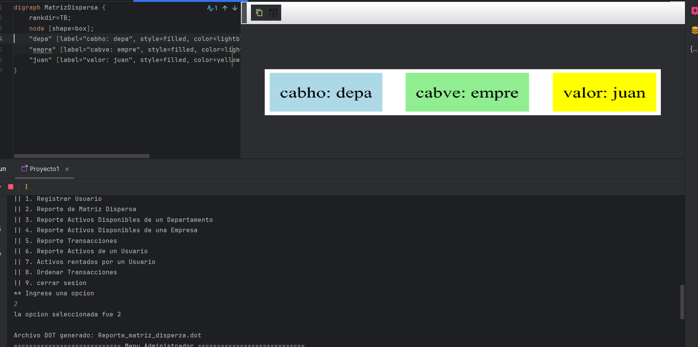
- le damos en cerrar
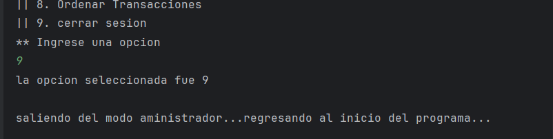
- iniciamos sesion como usuario y se mostrara el menu de usuario
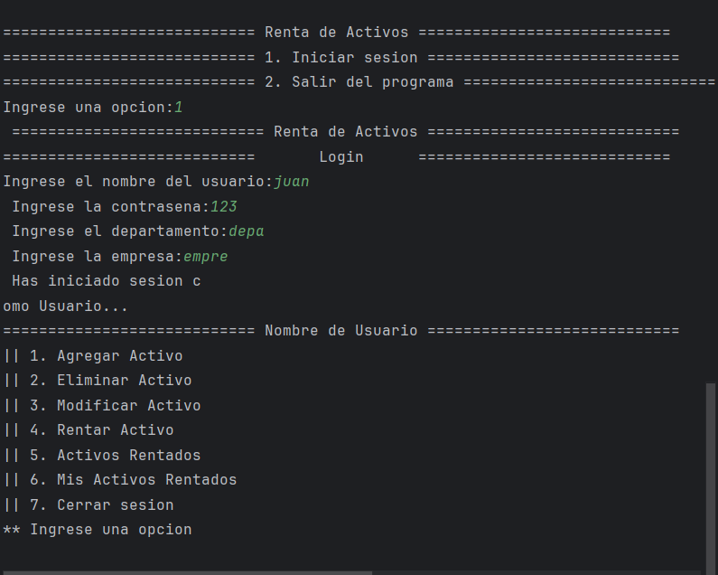
- se elige la opcion de agregar un activo y puedes agregar todos los activos que desees
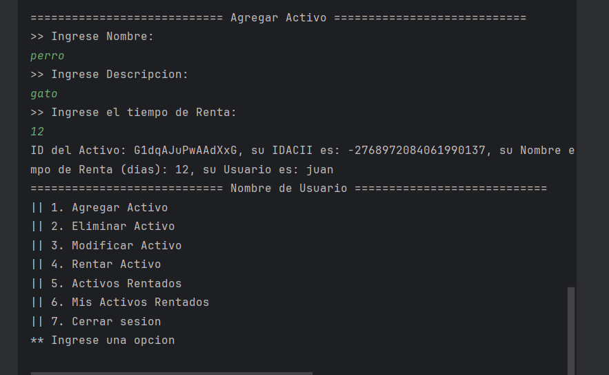
- en mi caso agregue 3 activos entonces le damos en elminar activo y aparecera la lista de los disponibles, adicional nos muestra su arbol
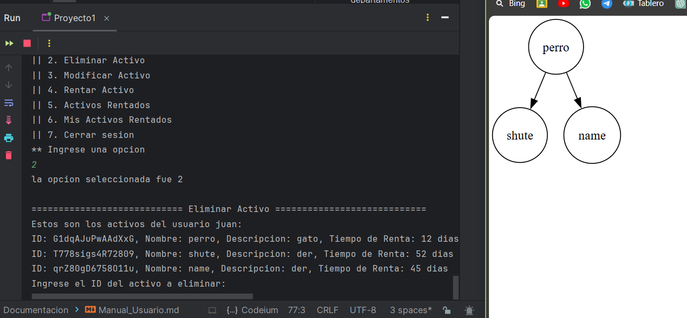
- eliminar un activo
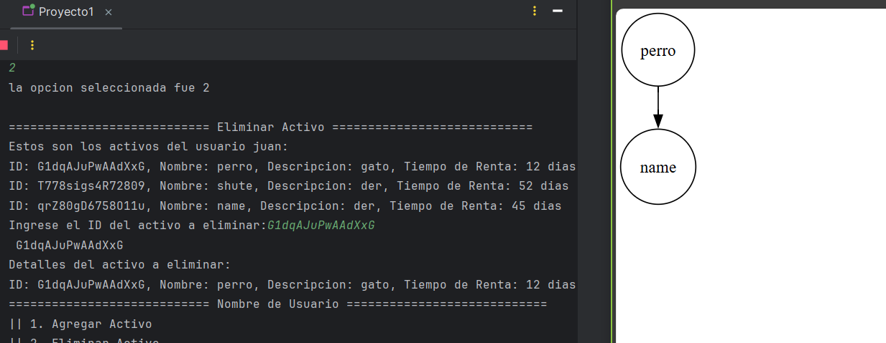
- se elige la opcion de modificar activo
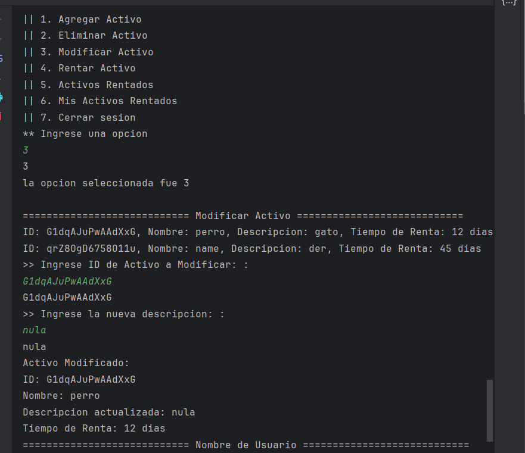
- se elige la opcion de rentar activo y como se puede ver ahi se cambio la descripcion y entonces aqui rentamos el activo y regresamos al menu
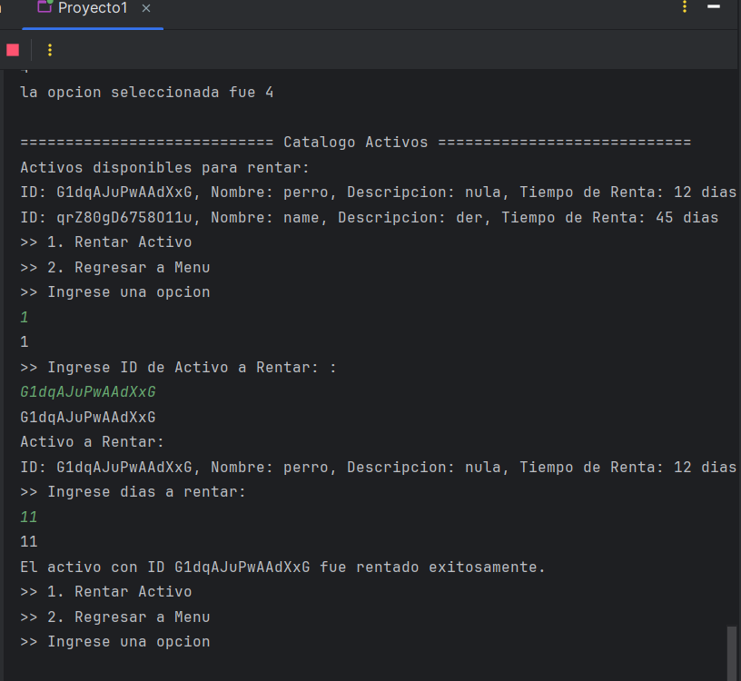
- si regresamos al rentar activo podemos ver que se no se muestra el que se rento
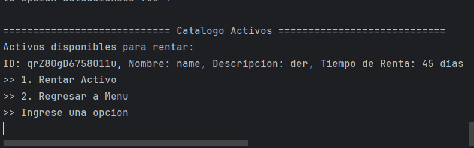
- ahora seleccionamos la de activo rentados
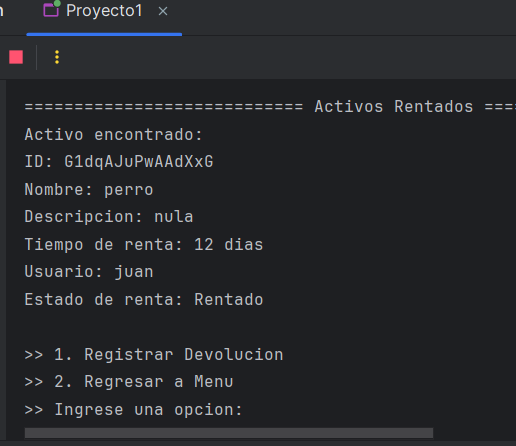
- ahora devolvemos dicho rentado y regresamos al menu
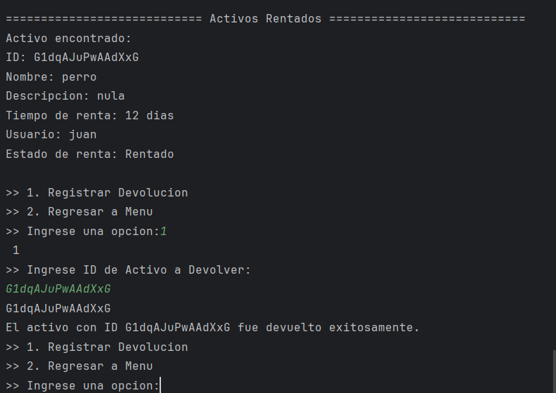
- el otro de mis activos rentados no lo logre hacer
- ahora cerramos sesion y regresamos al menu de administrador, seleecionamos la opcion de reporte de transacciones
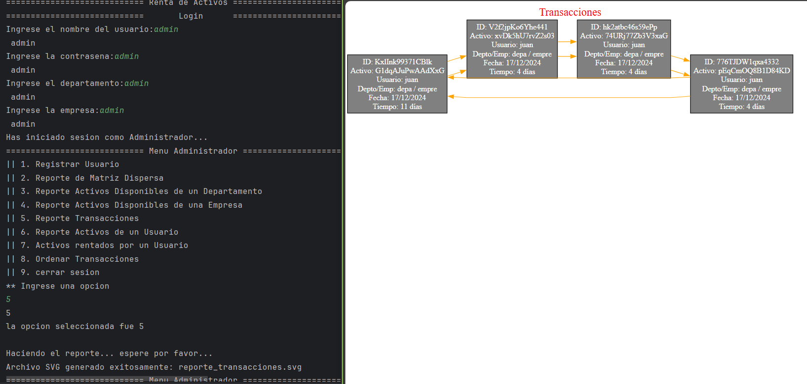
- ahora en la opcion de ordenar transacciones podemos ordenar dicha transaccion
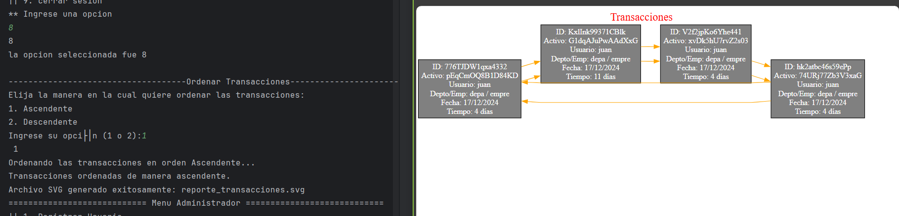
- la opcion 6 genera los activos rentados y los no rentados, rojo es rentado y verde es no rentado
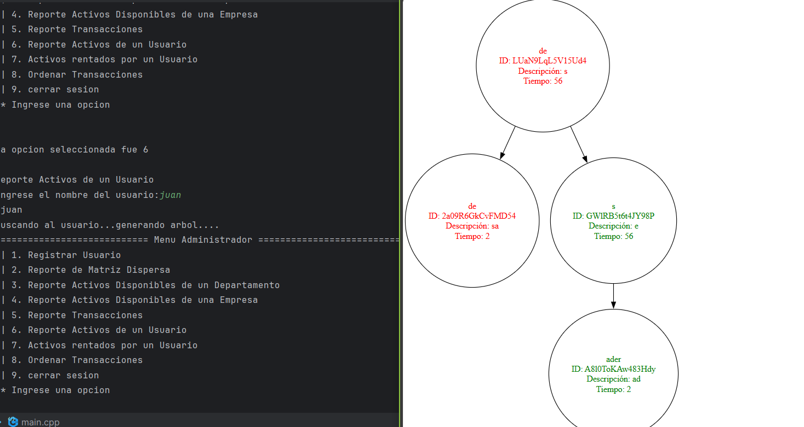
- cerramos sesion y terminamos el programa, no logre hacer los demas perdon :(
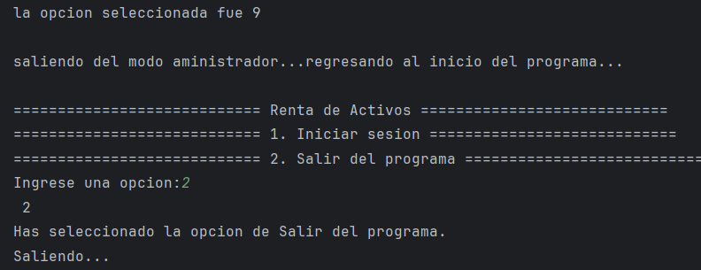

